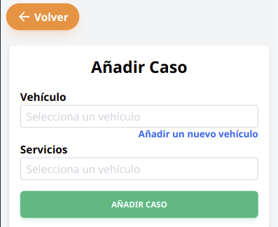
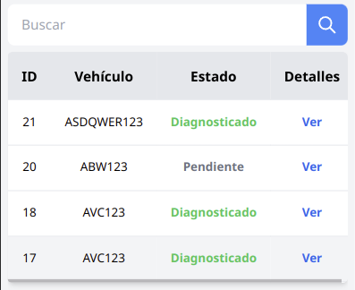
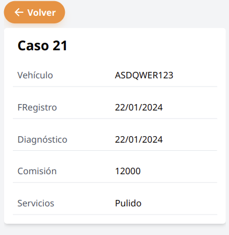

## Añadir caso

Se debe navegar a la página de casos, a través del menú, luego dar en el botón añadir caso.

Se debe rellenar el formulario con el vehículo, crear un nuevo vehículo oprimiendo en el texto azul,  y los servicios de manera obligatoria, luego añadir caso.

## Ver casos

Se debe navegar a la página de casos, a través del menú, muestra una tabla con los casos más recientes.

Para buscar un caso por su placa o el caso se ingresa en el cuadro de búsqueda y luego en el botón buscar, o con la lupa (o enter).
Para dejar los casos por defecto borrar la búsqueda y luego en el botón buscar.

Para ingresar en detalles de un caso se debe dar en la palabra de letras azules “ver”, se muestra los detalles del pago, volver para salir.

