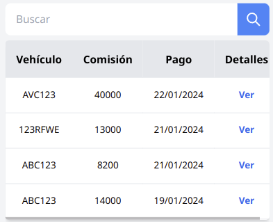
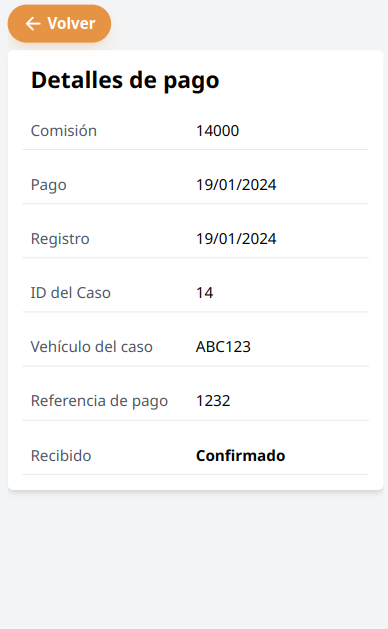
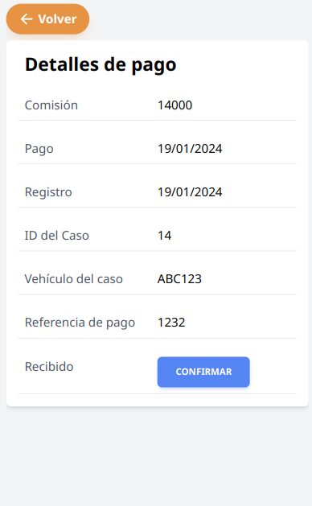

## Ver pagos

Se debe navegar a la página de pagos, a través del menú, se muestra una tabla con los pagos más recientes.

Para buscar un pago por vehículo o caso, se ingresa en el cuadro de búsqueda y luego en el botón buscar, o con la lupa (o enter).

Para dejar los pagos por defecto borrar la búsqueda y luego en el botón buscar.

Para ingresar en detalles de un pago se debe dar en la palabra de letras azules "ver", se muestra los detalles del pago, volver para salir.

## Confirmar recibido de pago

Para confirmar el recibido de pago debe dar en el botón azul de confirmar, ubicado en el detalle de cada pago.

