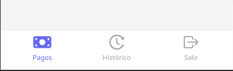
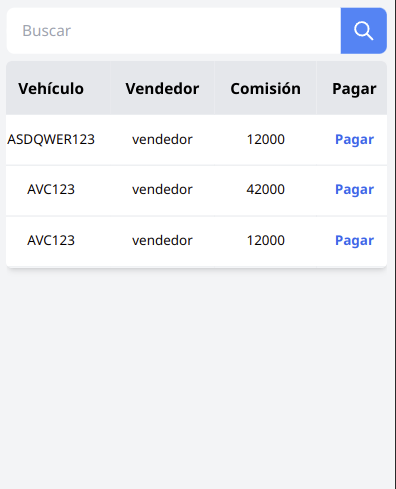
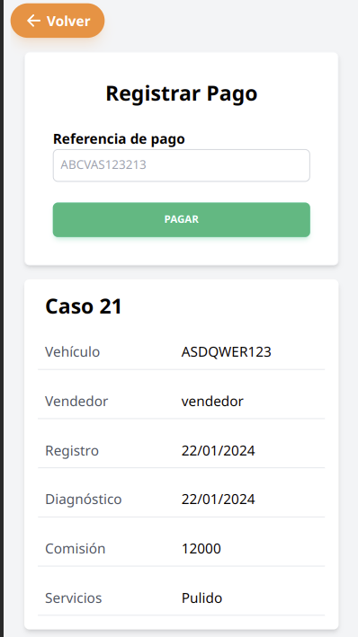
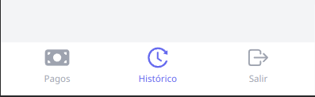
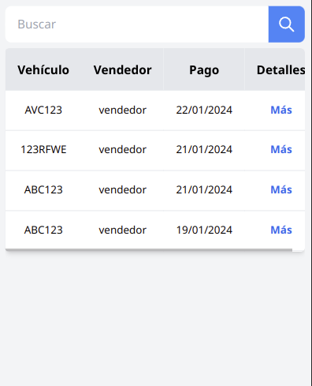
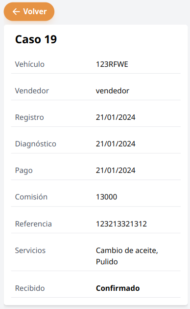

## Realizar pago

Se debe navegar a la página de pagos, a través del menú, se muestra una tabla con los diagnósticos más recientes.

Luego en la tabla debe darse en la palabra pagar en azul correspondiente al caso a pagar.

Para pagar se verifica que la información corresponda, se ingresa de manera opcional una referencia y luego en pagar.

## Historial de pagos

Se debe navegar a la página de historial, a través del menú, aparece una tabla con los pagos más recientes.

Para buscar por caso debe ser por su placa se ingresa en el cuadro de búsqueda y luego en el botón buscar, o con la lupa (o enter).
Para dejar los pagos por defecto borrar la búsqueda y luego en el botón buscar.

Para ingresar en detalles de un pago se debe dar en la palabra de letras azules “más”, se muestra los detalles del pago, volver para salir.

