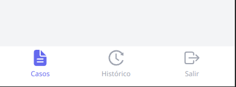
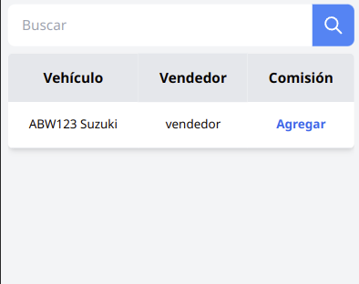
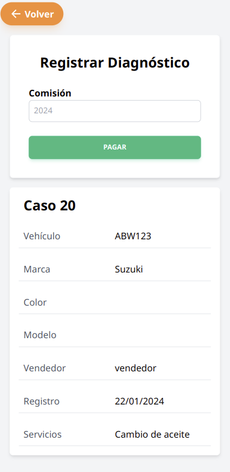
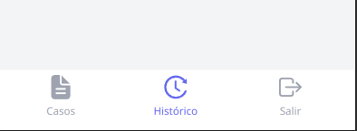
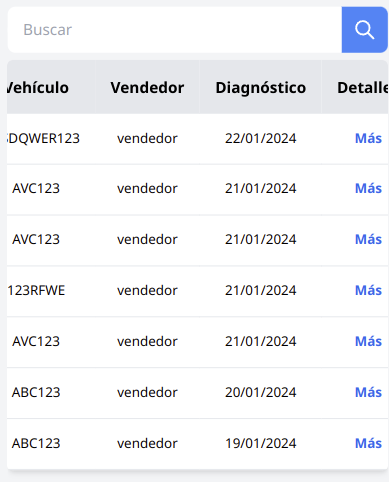
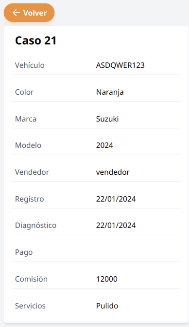

## Agregar diagnóstico

Se debe navegar a la página de casos, a través del menú, se muestra casos con fecha de creación más reciente.

Luego en la tabla debe darse en la palabra agregar en azul correspondiente al caso a diagnosticar.

Para diagnosticar se verifica que la información que corresponda, se ingresa de manera obligatoria una comisión y luego en pagar.

## Historial de diagnósticos

Se debe navegar a la página de historial, a través del menú, aparece una tabla con los diagnósticos más recientes.

Para buscar por caso debe ser por su placa se ingresa en el cuadro de búsqueda y luego en el botón buscar, o con la lupa (o enter).
Para dejar los casos por defecto borrar la búsqueda y luego en el botón buscar.

Para ingresar en detalles de un diagnóstico se debe dar en la palabra de letras azules “más”, se muestra los detalles del pago, volver para salir.

