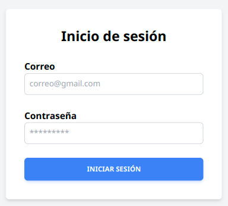
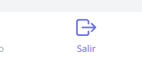
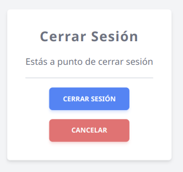
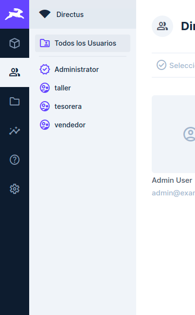
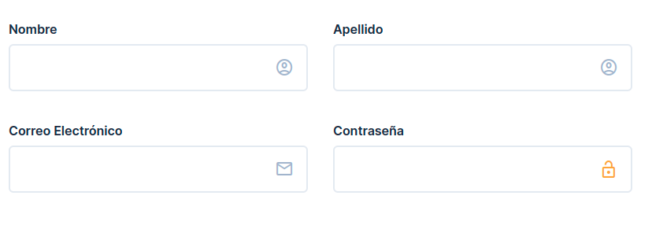
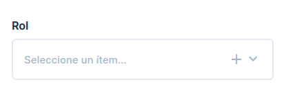
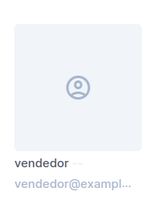
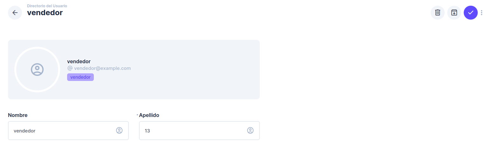
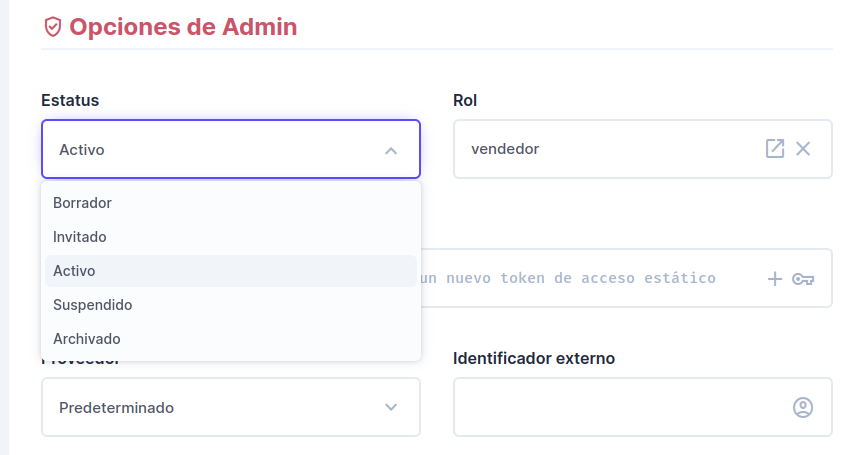

## Inicio de sesión

Debe introducirse un correo válido y una contraseña de una longitud mínima de 8 caracteres, luego click en el botón iniciar sesión, si la contraseña no coincide puede solicitar un cambio.

## Cerrar sesión

Debe darse click en el botón de salir de la parte inferior derecha.

Luego en el botón cerrar sesión.

## Creación de usuarios

Dentro de Directus dirigirse al menú de la izquierda y elegir la opción de usuarios(icono de personas).

Luego en la parte derecha clickear el botón de más.

Se debe llenar los campos de nombres, apellidos, correo y contraseña, recuerde el correo debe ser un correo válido(ejemplo@correo.com) y una contraseña de una longitud mínima de 8 caracteres.

Luego, se debe elegir un rol al final de la página.

Por último se guarda al dar click en el botón arriba a la derecha de un chulo.

## Editar usuarios

Dentro de Directus dirigirse al menú de la izquierda y elegir la opción de usuarios(icono de personas).

Luego buscar el usuario a editar y dar click en su cuadrado correspondiente.

Edite los campos necesario y guarde dando click en el chulo.

## Desactivar o activar usuarios

Dentro de Directus dirigirse al menú de la izquierda y elegir la opción de usuarios(icono de personas).

Luego buscar el usuario a editar y dar click en su cuadrado correspondiente.

Buscar al final de formulario el campo de estado, elegir activo para activar o suspendido para desactivar.

