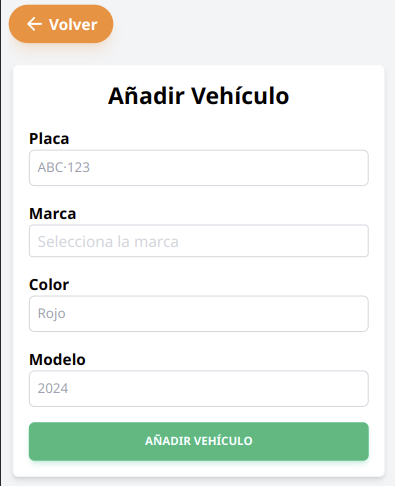
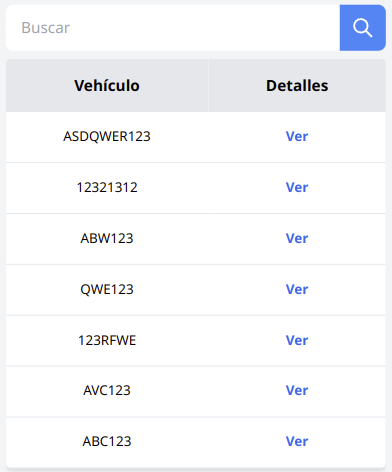
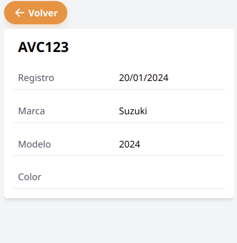

## Añadir vehículo
Se debe navegar a la página de vehículos, a través del menú, luego dar en el botón añadir vehículo.

Se debe rellenar el formulario con la placa y la marca de manera obligatoria, opcional el modelo y el color del vehículo, luego guardar.

## Ver vehículos
Se debe navegar a la página de vehículos, a través del menú. 

Se muestra una tabla con los vehículos más recientes. Para buscar un vehículo por su placa se ingresa en el cuadro de búsqueda y luego en el botón buscar, o con la lupa (o enter).
Para dejar los vehículos por defecto borrar la búsqueda y luego en el botón buscar.

Para ingresar en detalles de un vehículo se debe dar en la palabra de letras azules “ver”, se muestra los detalles del pago, volver para salir.

